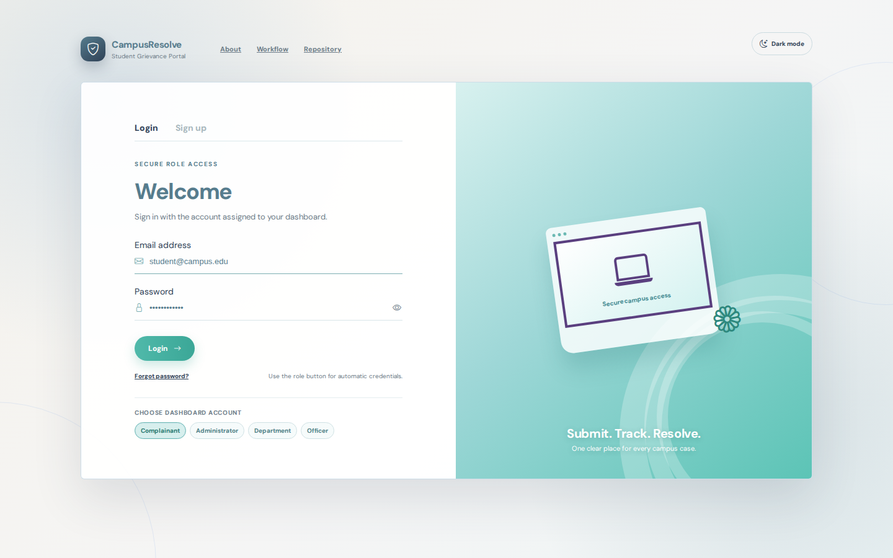
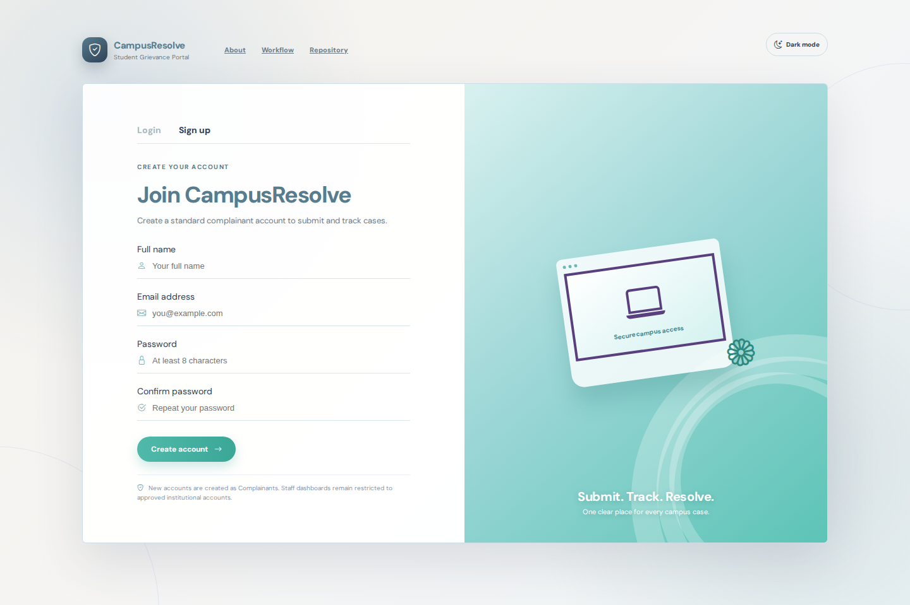
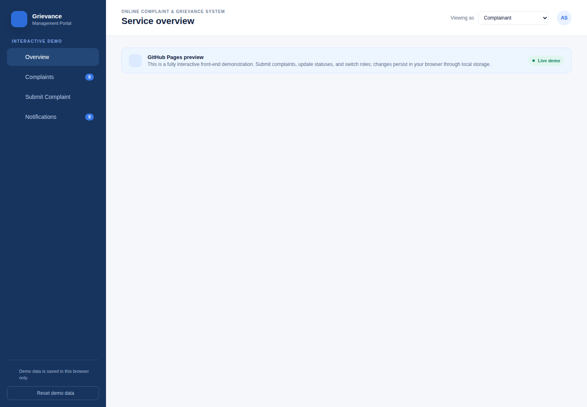
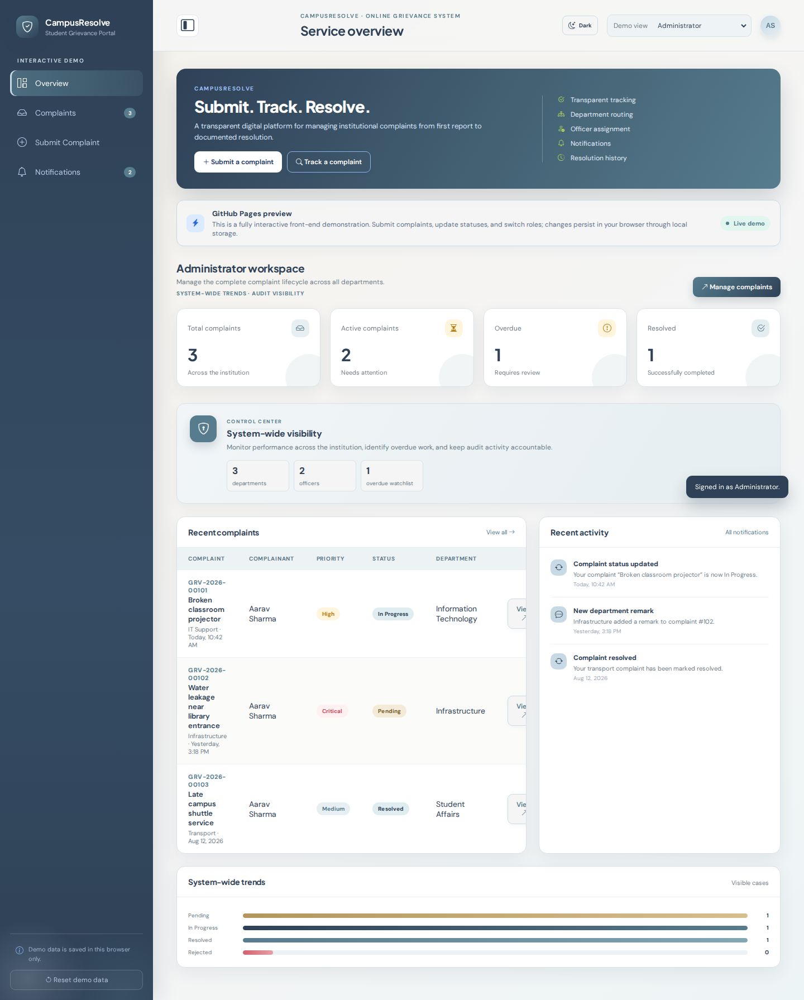
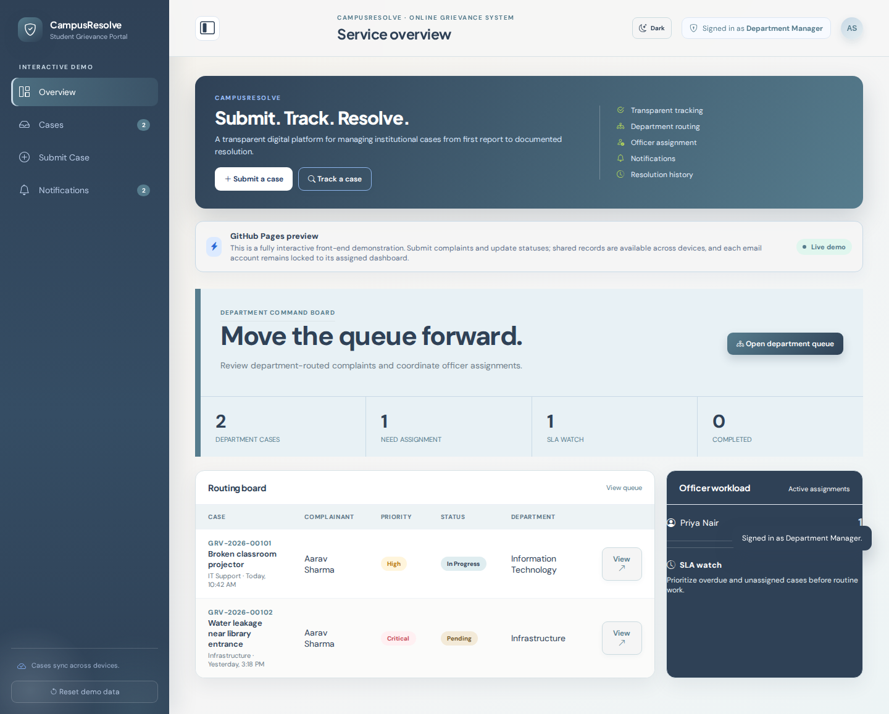
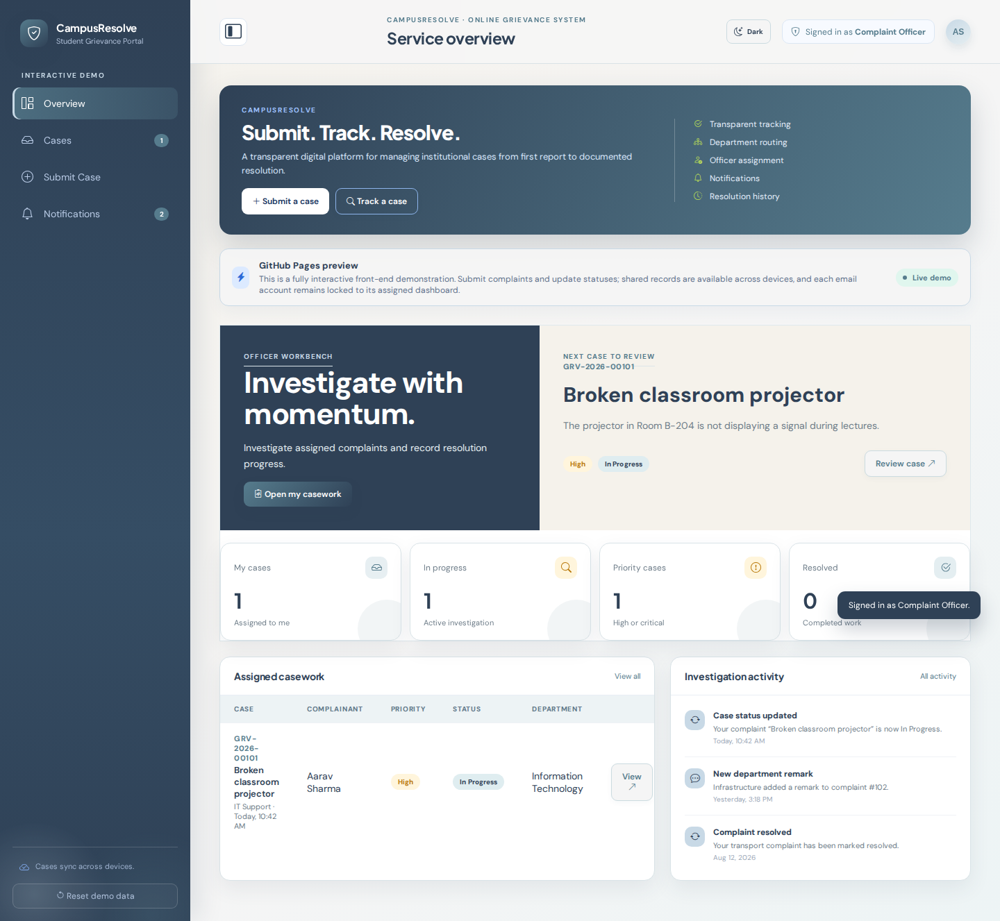

# Online Complaint & Grievance Management System

<p align="center">
  <strong>A complete role-based grievance portal for colleges and institutions</strong><br>
  Submit, route, investigate, resolve, and audit complaints through one transparent workflow.
</p>

<p align="center">
  <a href="https://campusresolve-php.onrender.com/login.php"></a>
  <a href="https://shubh0o7.github.io/complaint-management-system/"></a>
  <a href="https://github.com/Shubh0o7/complaint-management-system/actions/workflows/ci-cd.yml"></a>
  <a href="https://github.com/Shubh0o7/complaint-management-system"></a>
</p>

> **College-project showcase:** Open the [live interactive demo](https://shubh0o7.github.io/complaint-management-system/) to explore the portal immediately. The demo works entirely in the browser, while the repository also contains the complete PHP, MariaDB, Docker, and GitHub Actions implementation for a real server-backed deployment.

## Project at a glance

This project digitizes the full grievance lifecycle. In the public interface, a complaint is presented as a simpler **Case**: a complainant submits a case, an administrator routes it to the correct department, a department manager assigns an officer, and the officer records investigation progress and resolution. Every important action is represented through status updates, comments, notifications, and a chronological timeline.

| Capability | Implementation |
| --- | --- |
| **Four role workspaces** | Student Dashboard, administrator, department manager, and complaint officer, each with a distinct dashboard layout |
| **Case lifecycle** | Submission, routing, assignment, investigation, resolution, and rejection |
| **Traceability** | Status history, activity timeline, comments, remarks, notifications, and audit logs |
| **Multi-channel alerts** | Status-triggered in-app notifications, logged/SMTP-ready email alerts, and optional standards-based browser push alerts |
| **Delivery operations** | Retryable email/push queue, stale-claim recovery, delivery history, and administrator monitoring |
| **Evidence handling** | MIME-validated private uploads, authorized downloads, PDF receipts, and reference numbers |
| **Public presentation** | GitHub Pages interactive demo with local browser persistence |
| **Responsive navigation** | Slideable sidebar with desktop collapse, mobile drawer, backdrop dismissal, and accessible controls |
| **Production-style runtime** | PHP 8.3-compatible application, MariaDB, Docker Compose, CI/CD, SLA monitoring, and exports |

## Live application

### [Open the working PHP + MariaDB website on Render](https://campusresolve-php.onrender.com/login.php)

The server-backed application is live on Render and uses the direct SQL/MariaDB architecture described in this repository. Render's free service can spin down when idle, so the first request after inactivity may take longer than a warm request. The bundled database is intended for college-project evaluation; production use should move MariaDB to a managed persistent database and configure durable file storage.

### [Open the browser-based preview on GitHub Pages](https://shubh0o7.github.io/complaint-management-system/)

The GitHub Pages preview is designed for quick evaluation. Its login screen follows a split-screen reference layout and demonstrates the four locked role accounts. Account registration and shared Case persistence are handled by the direct SQL-backed PHP application, not by GitHub Pages. Visitors can authenticate into the four role dashboards, each with a distinct layout, inspect case queues, submit new cases, update statuses, view notification activity, and open case timelines. The dashboard sidebar collapses on desktop and opens as a slide-in drawer on mobile; a dimmed backdrop closes the mobile drawer when tapped. The static preview keeps sample Case records in the browser for presentation. Cross-device Case persistence is provided by the direct PHP/MariaDB application, where records are stored in the SQL database.

GitHub Pages is static hosting and cannot execute PHP or MySQL. For that reason, the public site is a browser-based presentation version, while the complete server-backed project remains available through Docker Compose.

## Interface screenshots

The authentication screen now uses a reference-inspired split layout with a soft teal visual panel, Login and Sign up tabs, rounded field treatment, and a responsive mobile arrangement.





The public preview includes a consistent interface for each operational role. These captures were refreshed from the current authenticated demo after the shared-storage and responsive-navigation updates; they use seeded demonstration data and are stored in the repository for academic evaluation.

| Complainant | Administrator |
| --- | --- |
|  |  |

| Department Manager | Complaint Officer |
| --- | --- |
|  |  |

## Design evidence

The project includes a complete academic documentation pack. The database schema is defined in the version-controlled [`database.sql`](database.sql) file and is provisioned automatically by the Docker setup. Documentation includes: [SRS](docs/SRS.md), [project report](docs/PROJECT-REPORT.md), [test cases](docs/TEST-CASES.md), [test results](docs/TEST-RESULTS.md), [database design](docs/DATABASE-DESIGN.md), [workflow and dashboard guide](docs/WORKFLOWS-AND-DASHBOARDS.md), [installation guide](docs/INSTALLATION.md), [deployment guide](docs/DEPLOYMENT.md), and [future scope](docs/FUTURE-SCOPE.md). The [diagram gallery](docs/diagrams/) contains the ER diagram, detailed ER diagram, DFD Levels 0–2, use-case diagram, system architecture, and complaint-submission sequence diagram.

## Demo login accounts

The live PHP application accepts only the exact email and password combination assigned to each seeded role, entered manually. Students may also register through `register.php`; new accounts are stored in the MySQL/MariaDB `users` table and can be used from another device connected to the same deployed application.

| Dashboard | Email | Password |
|---|---|---|
| Student Dashboard | `student@campus.edu` | `Student@1234` |
| Administrator | `admin@campus.edu` | `Admin@1234` |
| Department Manager | `manager@campus.edu` | `Manager@1234` |
| Complaint Officer | `officer@campus.edu` | `Officer@1234` |

The login form requires the visitor to enter an email address and password manually. There is no role selector and no automatic credential filling. The authenticated PHP account determines the dashboard redirect; the preview uses local sample records, while the complete PHP application reads and writes Case records directly through MySQL/MariaDB.

## Role-based workflow

```text
Complainant
    │ Submit complaint with category, priority, description, and evidence
    ▼
Administrator
    │ Review and route the case to a department
    ▼
Department manager
    │ Assign an available complaint officer
    ▼
Complaint officer
    │ Investigate, communicate, add remarks, and update status
    ▼
Resolution
    │ Notify the complainant and preserve the timeline
    ▼
Complainant
    └ View the outcome and complete complaint history
```

| Role | Main workspace | Responsibility |
| --- | --- | --- |
| **Complainant** | `dashboard.php`, `complaints.php`, `view_complaint.php` | Submit and track personal complaints, comments, evidence, notifications, and history |
| **Administrator** | `admin_dashboard.php`, `admin_complaints.php`, `admin_assignments.php`, `reports.php` | Manage all cases, route complaints, manage accounts, and review analytics |
| **Department manager** | `department_dashboard.php` | Review department-scoped cases, assign officers, and add departmental remarks |
| **Complaint officer** | `officer_dashboard.php` | Work assigned cases, investigate, communicate, and record outcomes |

## Features

### Responsive dashboard navigation

The demo dashboard uses a responsive sidebar designed for both desktop and mobile evaluation. The top-left control collapses or reopens the navigation rail on desktop screens. On mobile screens it opens a slide-in drawer with a backdrop overlay, closes when the backdrop is tapped, and automatically dismisses after a navigation item is selected. The control exposes its state through `aria-expanded`, `aria-label`, and tooltip text.

### Student Dashboard experience

Users can register and log in, manage their profile and contact information, update notification and appearance preferences, submit complaints with subjects, categories, priorities, descriptions, and attachments, then search and filter their complaint history. Each case includes status badges, metadata, evidence, comments, notifications, and a chronological activity timeline.

### Department and officer operations

Department managers see only cases routed to their department and can assign available officers. Officers see only their assigned cases and can add investigation remarks, communicate through comments, and move a complaint through `Pending`, `In Progress`, `Resolved`, or `Rejected`.

### Administration and reporting

Administrators have system-wide oversight, complaint routing, role-account management, status updates, notification review, reporting views with Chart.js visualizations, and institution settings for the portal name, support email, default SLA fallback, and system email controls. Server-side role guards prevent users from accessing workspaces outside their assigned scope.

## Technology

| Layer | Implementation |
| --- | --- |
| Frontend | HTML5, CSS3, Bootstrap 5.3, Bootstrap Icons, vanilla JavaScript |
| Backend | PHP 8.3-compatible server-side application |
| Database | MySQL or MariaDB with MySQLi prepared statements |
| Charts | Chart.js |
| **Authentication** | PHP sessions, password hashing, CSRF protection, reset tokens, and audit events |
| **File storage** | MIME-validated private attachment storage with authorized download endpoint |
| Demo hosting | GitHub Pages static interactive preview |
| Local runtime | Docker Compose with PHP-Apache and MariaDB |
| CI/CD | GitHub Actions with PHP linting, MariaDB smoke tests, and GHCR publishing |

## Automated testing

The repository includes a reproducible smoke-test script at [`tests/smoke_test.sh`](tests/smoke_test.sh). It checks the same project qualities that matter during evaluation: PHP syntax, JavaScript syntax, required deployment files, database and CI/CD markers, successful serving of the GitHub Pages HTML, CSS, and JavaScript assets, and the browser end-to-end authentication/theme flow when Playwright dependencies are installed.

Run it locally with:

```bash
./tests/smoke_test.sh
```

A successful run currently verifies:

| Test area | Result |
| --- | --- |
| PHP syntax | **50 PHP files passed** |
| GitHub Pages JavaScript syntax | **Passed with Node.js `--check`** |
| Browser end-to-end flow | **14 assertions: login, role switching, logout, dark mode, persistence** |
| Application, documentation, diagrams, and deployment files | **Passed** |
| Database and CI/CD configuration markers | **Passed** |
| Static HTML, CSS, and JavaScript serving | **Passed** |

The GitHub Actions workflow in `.github/workflows/ci-cd.yml` runs PHP validation, initializes MariaDB, performs login and dashboard smoke tests, builds the Docker image, and publishes the image to GitHub Container Registry on the default branch. Pull requests run validation without publishing deployment artifacts.

## Quick start: public demo

No installation is required for the browser demo:

1. Open the [live GitHub Pages website](https://shubh0o7.github.io/complaint-management-system/).
2. Enter an exact role credential from the table above manually. For a new user, open `register.php` in the deployed PHP application first, complete registration, then return to `login.php` and enter the new account details.
3. The dashboard shown is determined by the authenticated email account; there is no post-login role switch. Students must register before entering Student Dashboard. Each role uses a different layout pattern: split-screen student workspace, asymmetrical mosaic for the administrator, command board for the department manager, and featured-workbench layout for the officer.
4. Open **Submit Case** to create a demo case.
5. Open **Cases** to search, filter, and inspect a case.
6. Open **Notifications** to review activity.
7. Use the top-left sidebar control to collapse or reopen navigation. On mobile, tap the dimmed backdrop to close the drawer.

> The direct PHP application stores Case records in MySQL/MariaDB. GitHub Pages is only a static preview and does not write directly to SQL. Use **Reset demo data** in the preview sidebar to restore its local sample records.

## Quick start: complete PHP application

With Docker Desktop or Docker Engine installed, the complete server-backed application starts with one command:

```bash
git clone https://github.com/Shubh0o7/complaint-management-system.git
cd complaint-management-system
docker compose up --build
```

Open [http://localhost:8080](http://localhost:8080) after the containers become healthy. The database schema, application database user, departments, categories, uploads directory, and default administrator account are initialized automatically.

To reset the database and start from a clean state:

```bash
docker compose down -v
docker compose up --build
```

## Default administrator for local demonstration

| Field | Value |
| --- | --- |
| Email | `admin@cms.com` |
| Password | `admin123` |

These credentials are for development and evaluation only. Change the password before using the server-backed application with real data.

## College submission pack

The repository is organized so a professor can inspect both the running system and the engineering evidence without searching through unrelated files. Start with the live demo, then review the README screenshots, the [project report](docs/PROJECT-REPORT.md), and the [test results](docs/TEST-RESULTS.md). The full diagram sources and rendered PNGs are under `docs/diagrams/`, while role screenshots are under `docs/screenshots/modules/`.

## Project structure

```text
.
├── index.php                         PHP landing page and role redirect
├── index.html                        GitHub Pages demo entrypoint
├── login.php / register.php           Authentication screens
├── dashboard.php                      Student Dashboard
├── add_complaint.php                  Complaint submission form
├── complaints.php                     Student Case list
├── view_complaint.php                 Complaint detail, comments, files, timeline
├── department_dashboard.php           Department queue and officer assignment
├── officer_dashboard.php              Officer investigation queue
├── admin_dashboard.php                System overview
├── admin_complaints.php               Administrator complaint management
├── admin_assignments.php              Routing and role-account console
├── admin_users.php                    User and role management
├── reports.php                        Analytics dashboard
├── api/                               JSON and form-processing endpoints
├── includes/                          Auth, layout, notification, and workflow helpers
├── assets/                            Shared PHP application styles and scripts
├── docs/                              GitHub Pages demo, screenshots, diagrams, and guides
├── tests/smoke_test.sh                Reproducible local audit test
├── uploads/                           Local attachment storage
├── database.sql                       Complete schema and seed data
├── Dockerfile                         PHP-Apache application image
├── docker-compose.yml                 Application plus MariaDB stack
└── .github/workflows/ci-cd.yml        Automated test and deployment workflow
```

## Database model

The schema is organized around the complaint lifecycle. `users` stores all four role types and optional department membership. `departments` stores routing groups. `complaints` stores the case, assignment, priority, status, and remarks. Timeline, comment, attachment, and notification tables provide traceability and communication.

| Table | Responsibility |
| --- | --- |
| `users` | Authentication, roles, department membership, and account state |
| `departments` | Department directory and routing groups |
| `categories` | Complaint categories used by submission forms |
| `complaints` | Complaint records, assignments, statuses, priorities, and remarks |
| `complaint_timeline` | Activity and status history |
| `complaint_comments` | Conversation between complainants and staff |
| `complaint_attachments` | Evidence and supporting files |
| `notifications` | In-app status, assignment, comment, and system alerts |
| `push_subscriptions` | Browser endpoint and encryption keys for optional Web Push delivery |
| `push_notifications` | Auditable browser push delivery attempts and outcomes |

## Security and deployment notes

The application uses prepared MySQLi statements, password hashing, PHP session authentication, role guards, CSRF protection, expiring password-reset tokens, scoped complaint queries, MIME-detected uploads with random filenames, private download authorization, audit logs, SLA monitoring, and timeline records. The GitHub Pages preview adds strict role credential matching for demonstration. The full PHP deployment uses the version-controlled SQL schema as its source of truth for account, Case, notification, and audit data. Status changes flow through in-app notifications and the shared delivery dispatcher. Email attempts are stored in `email_notifications`; local mode logs messages, while production can enable `MAIL_ENABLED=1` and `MAIL_FROM` or replace the adapter with SMTP. Browser push subscriptions are stored in `push_subscriptions` and deliveries in `push_notifications`. For real push delivery, install Composer dependencies and configure `VAPID_PUBLIC_KEY`, `VAPID_PRIVATE_KEY`, and `VAPID_SUBJECT` outside version control. For production use, place secrets outside version control, enforce HTTPS, change the seeded administrator password, disable directory listing, and use a private database account with only the required permissions.

GitHub Pages is appropriate for the static project preview only. The PHP application must be deployed to a PHP-capable host with MariaDB, Docker, or the published container image. The GitHub Actions workflow supports an optional `DEPLOY_HOOK_URL` repository secret for hosting providers that expose a deployment hook.

## Useful commands

```bash
# Run the local repository smoke tests
./tests/smoke_test.sh

# Install the optional Web Push provider for real browser push delivery
composer install --no-dev --prefer-dist

# Set these outside version control when enabling real email/push delivery
# MAIL_ENABLED=1 MAIL_FROM=noreply@example.edu
# VAPID_PUBLIC_KEY=... VAPID_PRIVATE_KEY=... VAPID_SUBJECT=mailto:support@example.edu

# Process up to 25 queued email/push notifications
php bin/process_notification_queue.php 25

# Run the worker every minute in production using cron
# * * * * * cd /path/to/project && php bin/process_notification_queue.php 50 >> logs/queue-worker.log 2>&1

# Start the complete server-backed application
docker compose up --build

# Stop the stack
docker compose down

# Reset the local database volume
docker compose down -v

# Validate PHP syntax directly
find . -name '*.php' -not -path './.git/*' -print0 | xargs -0 -n1 php -l

# Inspect repository state
git status
```

## License

This project is provided for educational and demonstration purposes. Add an explicit license before distributing it as a reusable software product.
